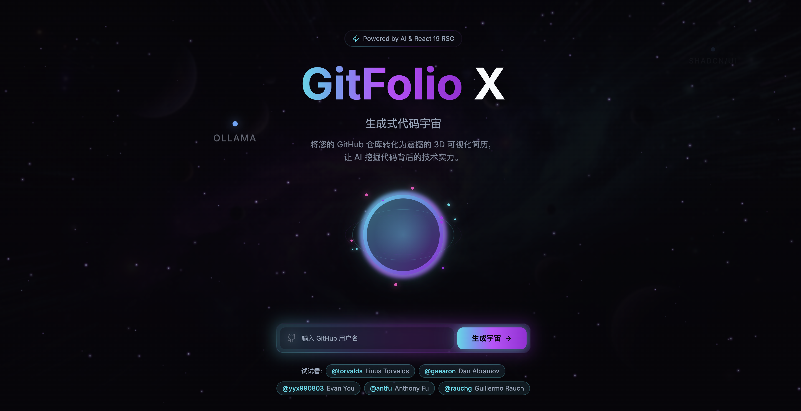

# GitFolio X - 生成式代码宇宙

> **本项目由阿里云 ESA 提供加速、计算和保护**

<div align="center">
  
</div>

> **将枯燥的代码仓库转化为 3D 可视化交互简历，利用 AI 挖掘代码背后的技术实力**

<div align="center">
  <h1>🌌 GitFolio X</h1>
  <p><strong>让 HR 看懂你的代码实力</strong></p>
</div>

## 🚀 项目简介 (Project Overview)

**GitFolio X** (代号: Galaxy) 是一款融合了生成式 AI 与 3D 渲染技术的创新 GitHub 简历引擎。它不仅能将开发者的 GitHub 生涯转化为震撼的 3D 星系宇宙，更通过深度 AI 分析挖掘代码背后的“灵魂”，让每一位极客都能拥有一份会呼吸、有深度的交互式简历。

<div align="center">
  
</div>

我们从三个维度重新定义开发者简历：

### 🛠️ 实用性：打破信息鸿沟 (Practicality)

- **辅助人才洞察**: 在海量简历中，HR 往往难以通过 Star 数判断真实代码质量。GitFolio X 通过 AI 深度采样审计，提炼核心亮点，协助招聘方秒懂候选人的技术边界。
- **一键极客简历**: 告别千篇一律的 PDF 模板，输入 GitHub ID 即可生成。通过“技术画像”和“六维雷达”量化硬核实力，让自我评价不再苍白无力。
- **结构化报告导出**: 完美平衡视觉震撼与正规申请需求，支持生成专业排版的技术报告 PDF，覆盖技术栈分布、代码质量等核心指标。

### 🎨 创意性：艺术化的代码表达 (Creativity)

- **生成式代码星系**: 每一个 Repository 是一颗星球，其大小象征规模，颜色代表技术。每一次 Commit 是流向星球的星尘。用户的开发者生涯不再是冷冰冰的数据，而是一个可以无限缩放、探索的星系。
- **万星聚会背景**: 背景动态加载 GitHub 实时趋势中的 TOP 30 开源项目（前端与 AI 领域）。让用户的代码宇宙与全球最火的项目交相辉映，营造“极客宇宙”的仪式感。
- **AI 叙事化解读**: 我们不只是在统计行数。AI 会阅读核心模块逻辑，为开发者生成“技术特质描述”，将繁杂的提交记录转化为具有故事性的技术总结。

### 🧠 技术深度：现代工程化实践 (Technical Depth)

- **React 19 生产级应用**: 采用最新 React 19 框架，深度应用 Metadata Hoisting 等新特性，在保证 SEO 的同时，实现了无缝的页面切换与资源加载优化。
- **高性能 3D 渲染器**: 基于 **React Three Fiber (R3F)** 构建，结合自定义 Shader、Instanced Mesh 和 Bloom 后处理管线，在 Web 浏览器中实现了电影级的粒子宇宙效果，且保持了流畅的帧率。
- **边缘 AI 分析架构**: 后端基于 **Supabase Edge Functions**，利用 Deno 毫秒级启动特性，集成 **Gemini 2.5 Flash** 极速推理模型，实现了低延迟、高并发的代码采样与智能分析。
- **智能数据聚合层**: 深度整合 **GitHub GraphQL API**，利用采样算法与内存缓存，在最小化 API 配额消耗的同时，获取最精准的贡献轨迹与代码细节。

## ✨ 核心功能 (Key Features)

### � 极速入口

- 仅需输入 GitHub Username，无需 OAuth 登录
- 实时流式反馈 AI 分析进度

### 🌌 3D 代码星系

- 每个 Repository 是一个**星球**（大小取决于代码量/复杂度）
- 每次 Commit 是环绕星球的**粒子**（颜色代表编程语言）
- 支持拖拽旋转、点击交互探索
- 炫酷的 Bloom 后处理效果

### 🤖 AI 技能分析

- **代码质量审计**: AI 采样阅读核心逻辑
- **自然语言报告**: 生成招聘经理可读的技术画像
- **技能雷达图**: 前端/后端/DevOps/算法/架构/文档 六维评估

### 📊 数据可视化与导出

- **[NEW] 热门趋势背景**: 背景实时随机点亮近一年最火的前端与 AI 开源项目，打造“万星聚会”的沉浸式宇宙。
- **[NEW] 专业 PDF 导出**: 一键生成精美排版的技术画像 PDF 报告，支持分页优化与高质量矢量图形。
- **编程语言分布饼图**: 精确的语言占比分析。
- **贡献热力图**: 还原 GitHub 真实的贡献轨迹。
- **项目卡片展示**: 优雅地陈列核心开发成果。

## 🛠 技术栈 (Tech Stack)

本项目采用现代化全栈架构，整合了前沿技术：

### Core Framework

- **[Vite](https://vitejs.dev/)** - 极速构建工具
- **[React 19](https://react.dev/)** - 最新版 UI 核心库
- **[TypeScript](https://www.typescriptlang.org/)** - 类型安全保证

### UI & Experience

- **[Tailwind CSS](https://tailwindcss.com/)** - 实用优先的 CSS 框架
- **[Shadcn UI](https://ui.shadcn.com/)** - 高质量组件库 (基于 Radix UI)
- **[Lucide React](https://lucide.dev/)** - 精美图标集
- **[Sonner](https://sonner.emilkowal.ski/)** - 优雅的 Toast 组件

### 3D Visualization

- **[React Three Fiber](https://docs.pmnd.rs/react-three-fiber)** - React 版 Three.js
- **[@react-three/drei](https://github.com/pmndrs/drei)** - R3F 实用工具集
- **[Three.js](https://threejs.org/)** - WebGL 3D 渲染引擎

### Backend & Database

- **[Supabase](https://supabase.com/)** - 开源 Firebase 替代方案
  - **Edge Functions** - 无服务器函数（Deno 运行时）
  - **PostgreSQL** - 数据缓存存储
  - **GraphQL API** - GitHub 数据获取

### AI Integration

- **OpenRouter API** - 多模型网关
- **Gemini 2.5 Flash** - 代码分析 LLM

### State & Data

- **[React Query](https://tanstack.com/query/latest)** - 异步数据管理
- **[React Router](https://reactrouter.com/)** - 路由管理
- **[React Hook Form](https://react-hook-form.com/)** + **[Zod](https://zod.dev/)** - 表单与验证

### Visualization

- **[Recharts](https://recharts.org/)** - 基于 React 的图表库

## 🏗 架构概览 (Architecture)

```
┌─────────────────────────────────────────────────────────────┐
│                        Frontend (Vite + React)               │
│  ┌─────────────┐  ┌─────────────┐  ┌─────────────────────┐  │
│  │  3D Galaxy  │  │  AI Report  │  │  Charts & Stats     │  │
│  │  (R3F)      │  │  Display    │  │  (Recharts)         │  │
│  └─────────────┘  └─────────────┘  └─────────────────────┘  │
└────────────────────────────┬────────────────────────────────┘
                             │
                             ▼
┌─────────────────────────────────────────────────────────────┐
│                    Supabase Edge Functions                   │
│  ┌─────────────────────┐  ┌─────────────────────────────┐   │
│  │  github-data        │  │  analyze-code               │   │
│  │  ├─ GraphQL API     │  │  ├─ Lovable AI Gateway      │   │
│  │  ├─ REST Fallback   │  │  └─ Gemini 2.5 Flash        │   │
│  │  └─ Cache Layer     │  │                             │   │
│  └─────────────────────┘  └─────────────────────────────┘   │
└────────────────────────────┬────────────────────────────────┘
                             │
                             ▼
┌─────────────────────────────────────────────────────────────┐
│  ┌─────────────────────┐  ┌─────────────────────────────┐   │
│  │  GitHub API         │  │  Supabase PostgreSQL        │   │
│  │  (GraphQL v4)       │  │  (github_cache table)       │   │
│  └─────────────────────┘  └─────────────────────────────┘   │
└─────────────────────────────────────────────────────────────┘
```

## 🔧 Supabase 配置

本项目使用 Supabase 提供后端服务：

### Edge Functions

| 函数名         | 功能                                 | 端点            |
| -------------- | ------------------------------------ | --------------- |
| `github-data`  | 获取 GitHub 用户数据（GraphQL/REST） | `/github-data`  |
| `analyze-code` | AI 代码分析与技术画像生成            | `/analyze-code` |

### 数据库表

```sql
-- github_cache: 缓存 GitHub 数据（默认 6 小时 TTL）
CREATE TABLE github_cache (
  username TEXT PRIMARY KEY,
  data JSONB NOT NULL,
  updated_at TIMESTAMP WITH TIME ZONE DEFAULT NOW()
);
```

### 环境变量

```bash
# Supabase
VITE_SUPABASE_URL=your_supabase_url
VITE_SUPABASE_ANON_KEY=your_anon_key

# GitHub (用于 Edge Function)
GITHUB_TOKEN=your_github_token  # 提高 API 速率限制
GITHUB_CACHE_TTL_HOURS=6        # 缓存时间（可选）

# AI (用于 Edge Function)
LOVABLE_API_KEY=your_lovable_api_key

# OpenRouter (用于前端备用)
VITE_OPENROUTER_API_KEY=your_openrouter_key
```

## � 快速开始 (Getting Started)

### 1. 环境准备

确保您的环境已安装 Node.js (推荐 v18+) 和 pnpm。

### 2. 安装依赖

```bash
# 克隆项目
git clone <YOUR_GIT_URL>
cd gitfolio-x

# 安装依赖
pnpm install
```

### 3. 配置环境变量

```bash
# 复制环境变量模板
cp .env.example .env

# 编辑 .env 文件，填入必要的配置
```

### 4. 启动开发服务器

```bash
pnpm dev
```

现在访问 [http://localhost:5173](http://localhost:5173) 即可开始体验。

### 5. 部署 Supabase Functions（可选）

```bash
# 登录 Supabase CLI
supabase login

# 链接项目
supabase link --project-ref <your-project-ref>

# 部署 Edge Functions
supabase functions deploy github-data
supabase functions deploy analyze-code
```

## 📦 部署 (Deployment)

本项目支持部署到所有现代静态托管平台（Vercel, Netlify, Github Pages, ESA Pages 等）。

1. **构建项目**:

   ```bash
   pnpm build
   ```

   构建产物将输出到 `dist` 目录。

2. **部署**:
   - 将 `dist` 目录内容发布到您的静态 Web 服务器即可。

## 📁 项目结构

```
gitfolio-x/
├── src/
│   ├── components/          # React 组件
│   │   ├── ui/              # Shadcn UI 组件
│   │   ├── CodeGalaxy.tsx   # 3D 星系核心组件
│   │   ├── StarField.tsx    # 星空背景
│   │   ├── PlanetBackground.tsx # 热门项目动态背景
│   │   ├── SkillsRadar.tsx  # 技能雷达图
│   │   ├── ProfilePdfDocument.tsx # PDF 导出核心模板
│   │   └── ...
│   ├── lib/
│   │   └── ai/              # AI 集成
│   │       └── openrouter.ts
│   ├── integrations/        # 第三方集成
│   │   └── supabase/
│   ├── pages/               # 页面组件
│   └── types/               # TypeScript 类型定义
├── supabase/
│   ├── functions/
│   │   ├── github-data/     # GitHub 数据获取
│   │   └── analyze-code/    # AI 代码分析
│   └── migrations/          # 数据库迁移
├── public/                  # 静态资源
└── ...
```

## 🤝 贡献说明

欢迎提交 Issue 和 Pull Request 帮助改进项目！提交前请确保通过 lint 和 type check：

```bash
pnpm lint
pnpm build
```

## 📄 参赛声明

本项目承诺所用代码及设计均为原创，并未侵犯任何第三方权益。
本项目由阿里云 ESA 提供加速、计算和保护。

## 📜 许可证 (License)

MIT License
